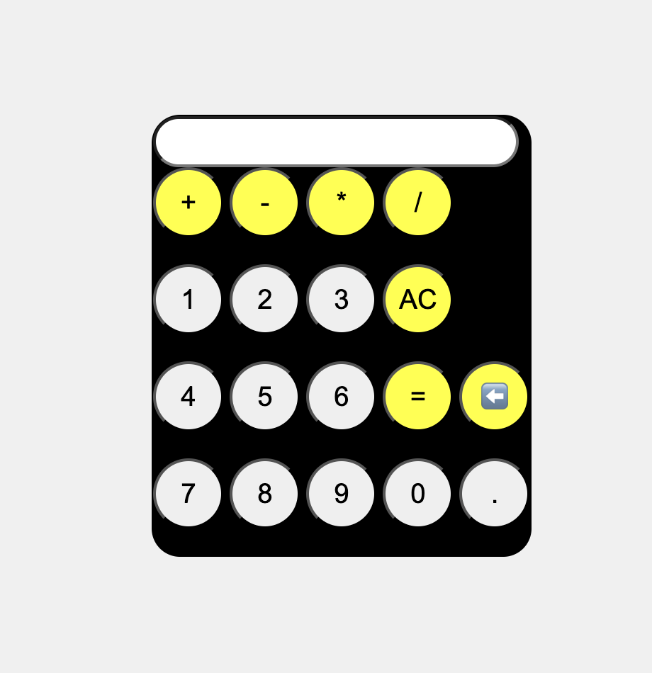

# 🧮 Simple Calculator

A simple calculator built using **HTML, CSS, and JavaScript**. It performs basic arithmetic operations with a clean and responsive user interface.

## 📸 Screenshot

<p align="center">
  
</p>

## ✨ Features

- ➕ Addition
- ➖ Subtraction
- ✖️ Multiplication
- ➗ Division
- 🧹 Clear (AC)
- ⌫ Backspace
- 🖱️ Interactive button hover effects
- 📱 Responsive design

## 🛠️ Technologies Used

- HTML5
- CSS3
- JavaScript

## 🚀 How to Run

1. Download or clone this repository.
2. Open the project folder.
3. Open `index.html` in your web browser.

No installation is required.

## 📂 Project Structure

```
Calculator/
│── index.html
│── style.css
│── script.js
│── calculator.png
└── README.md
```

## 🎯 Future Improvements

- ⌨️ Keyboard support
- 🧮 Scientific calculator functions
- 📜 Calculation history
- 🌙 Dark/Light mode
- 📱 Improved mobile responsiveness

## 👨‍💻 Author

**Nithish Kumar**

GitHub: https://github.com/Nithishvarma10

---

⭐ If you found this project helpful, consider giving it a star!